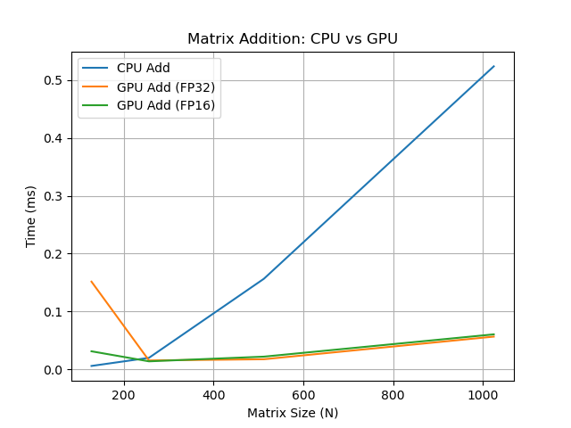
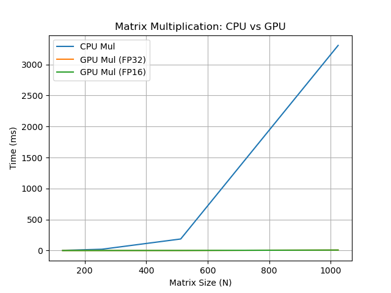

# FastMatrix: GPU-Accelerated Linear Algebra Library (CUDA + CPU Baseline)

A high-performance project implementing **matrix addition and multiplication** on both **CPU and GPU (CUDA)**, with runtime benchmarking and result plotting for easy comparison.

---

## 🚀 Quick Start

```bash
# Build and run benchmarks
mkdir -p build && cd build
cmake ..
make -j
./fastmatrix

# Plot results (from project root)
python3 scripts/plot_results.py
```

---

## 🛠 Requirements

- C++17 compiler (for CPU)
- CUDA Toolkit (for GPU)
- Python 3 with `matplotlib` and `pandas` (for plotting)

---

## 📦 Features

- ✅ **Matrix Addition & Multiplication** (CPU + CUDA versions)
- ⚡ **Performance Benchmarking** (CPU vs GPU runtime)
- 🧠 **Easily Configurable Matrix Size**
- 📊 **Result Logging and Plotting** (CSV + Python/Matplotlib)
- 💻 **Runs on both Mac/Linux (CPU) and NVIDIA GPUs (CUDA)**

---

## 🗂️ Repository Structure

```
.
├── CMakeLists.txt
├── src/
│   ├── mat_ops.cu          # CUDA GPU version
│   ├── mat_ops_cpu.cpp     # Portable CPU version (runs on macOS/Linux)
│   ├── fastmatrix.h        # Function declarations
│   ├── benchmark.cpp       # Benchmark runner
├── scripts/
│   └── plot_results.py     # Python script to plot benchmark results
├── build/
│   └── data/
│       └── results.csv     # Benchmark output (auto-generated)
├── runtime_add_comparison.png   # Addition plot (auto-generated)
├── runtime_mul_comparison.png   # Multiplication plot (auto-generated)
└── README.md
```

---

## ⚙️ Setup and Usage

### Option 1: Run on **CPU (Mac / Linux)**

No GPU required!  
Compile and run the CPU-only version:

```bash
cd src
g++ -O2 mat_ops_cpu.cpp -o mat_ops_cpu
./mat_ops_cpu
```

### Option 2: Run on **GPU (CUDA)**

Requires an NVIDIA GPU and CUDA toolkit.

#### Build with CMake

```bash
mkdir -p build
cd build
cmake ..
make -j
./fastmatrix
```

#### Or Compile CUDA File Directly (for quick test)

```bash
cd src
nvcc mat_ops.cu -o mat_ops
./mat_ops
```

---

## 📊 Benchmarking & Plotting

1. Run the benchmark executable (`./fastmatrix`).  
   This will generate `build/data/results.csv` with timing results for various matrix sizes.

2. Plot the results using Python (from the project root):

```bash
python3 scripts/plot_results.py
```

This will generate PNG plots in the project root:
- `runtime_add_comparison.png`
- `runtime_mul_comparison.png`

---

## 📊 Performance Plots

**Matrix Addition: CPU vs GPU**



**Matrix Multiplication: CPU vs GPU**



---

## 📊 Performance Comparison

| Matrix Size (N) | CPU Add (ms) | GPU Add (FP32) (ms) | GPU Add (FP16) (ms) | CPU Mul (ms) | GPU Mul (FP32) (ms) | GPU Mul (FP16) (ms) |
|-----------------|--------------|---------------------|---------------------|--------------|---------------------|---------------------|
| 128             | 0.005761     | 0.151584            | 0.031104            | 2.29485      | 0.04096             | 0.040992            |
| 256             | 0.019805     | 0.015264            | 0.013728            | 20.6608      | 0.140448            | 0.1384              |
| 512             | 0.156584     | 0.017344            | 0.021856            | 186.071      | 0.941376            | 0.945024            |
| 1024            | 0.524063     | 0.056512            | 0.060416            | 3307.91      | 7.34032             | 7.35696             |

---

## 🧾 License

MIT License
